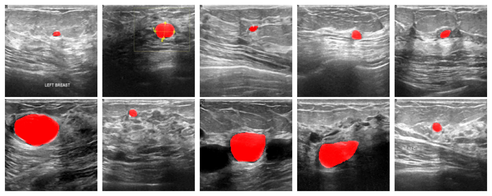
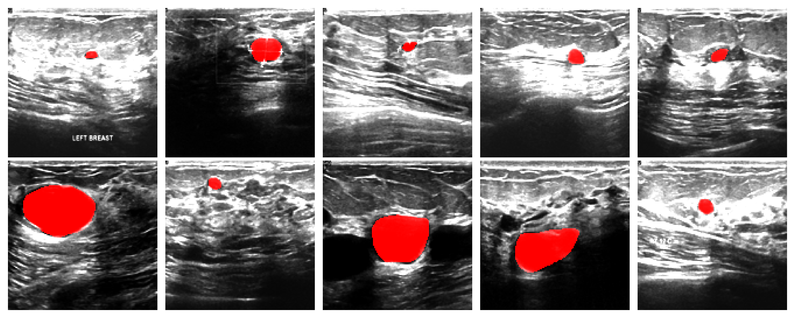

# Breast Ultrasound Segmentation Project

## Project Objective
This project utilizes the **MT_small_dataset**, a breast ultrasound dataset available at [Kaggle](https://www.kaggle.com/datasets/mohammedtgadallah/mt-small-dataset). The goal is to:

> 1. Train and compare segmentation models for the "Benign_Original" and "Fuzzy_Benign" datasets.
> 2. Select and utilize an appropriate network for segmentation.
> 3. Split the dataset into training, validation, and test sets in a 7:2:1 ratio.

## Dataset Description
The dataset comprises 1200 breast ultrasound (BUS) images, including benign and malignant cases, along with their respective ground truth segmentation labels. This dataset was originally introduced in the following study:

> Badawy, Samir M., et al. "Automatic semantic segmentation of breast tumors in ultrasound images based on combining fuzzy logic and deep learning—A feasibility study." PLOS ONE, 2021, e0251899.
  
### Dataset Structure
The dataset is divided into folders, but for this project, only the following subsets from the **Benign Folder** are used:

### Benign Folder
- **Original_Benign:** 200 BUS images (128 × 128 × 3) with benign cancer.
- **Fuzzy_Benign:** 200 contrast-enhanced BUS images (128 × 128 × 3) with benign cancer.
- **Ground_Truth_Benign:** 200 ground truth segmentation masks (128 × 128).

### Enhanced Images
The **Fuzzy-enhanced BUS images** were generated using an **FIO-based method** for contrast enhancement. 
<p align="center">
 
 
</p>

### Sample Visualization: Overlay of Images and Ground Truth

To provide a clearer understanding of the dataset and its annotations, we visualized the overlap of the images from **Original_Benign** and **Fuzzy_Benign** with their corresponding segmentation masks from **Ground_Truth_Benign**.

<p align="center">
 
 <br>
 <b>Figure 1:</b> Original_Benign image overlaid with Ground_Truth_Benign.
</p>

<p align="center">
 
 <br>
 <b>Figure 2:</b> Fuzzy_Benign image overlaid with Ground_Truth_Benign.
</p>

---

## Installation
Please follow the commands below for more details.

### 1. Clone this repository.
```
git clone https://github.com/th-yong/Breast-Ultrasound
```

### 2. Create conda environment and install required python packages.
```
conda create -n BUS python=3.10
```

### 3. Install packages from requirements.txt.
```
pip install -r requirements.txt
```

---

## Usage

This project allows training and testing segmentation models on the **MT_Small_Dataset**. Depending on your use case, you can choose between the **Original_Benign** or **Fuzzy_Benign** datasets.

---

### Training

To train the segmentation model, run the following command:

```
python main.py --mode train --dataset fuzzy
```

- **Arguments**:
  - `--mode`: Specifies the mode of execution. Use `train` to start training.
  - `--dataset`: Specifies which dataset to use. Options are `original` or `fuzzy`.
---

### Testing

To test a saved segmentation model, run the following command:

```
python main.py --mode test --dataset fuzzy --model_path ./results/best_model_fuzzy_valdice_0.85.pth
```

- **Arguments**:
  - `--mode`: Specifies the mode of execution. Use `test` to start testing.
  - `--dataset`: Specifies which dataset to use. Options are `original` or `fuzzy`.
  - `--model_path`: Path to the saved model file to evaluate.

---

## Results

### Metrics
The segmentation model is evaluated using the **Dice Coefficient Score**, which is calculated during training and testing. The best-performing model is saved with the score embedded in the filename for traceability.

#### Example:
```
./results/best_model_fuzzy_valdice_0.85.pth
```

---

### Example Output

- **Training**:
```
Epoch 1/100 - Train Loss: 0.2301, Val Loss: 0.2145, Val Dice: 0.8502
...
Best model saved as ./results/best_model_fuzzy_valdice_0.85.pth with Val Dice: 0.8502
```

- **Testing**:
```
Testing model: ./results/best_model_fuzzy_valdice_0.85.pth
Test Dice Score: 0.8420
```

---

### Directory Structure

The directory structure is organized as follows:

```
Breast-Ultrasound/
│
├── data/               # Dataset and preprocessing scripts
│   ├── dataset.py      # Dataset class definitions
│   └── transforms.py   # Image transformation definitions
│
├── models/             # Model definitions
│   └── unet.py         # U-Net architecture
│
├── utils/              # Utility functions
│   ├── dice_loss.py    # Dice Loss implementation
│   └── visualize.py    # Visualization tools
│
├── results/            # Model checkpoints
├── main.py             # Entry point for training/testing
├── requirements.txt    # Python package dependencies
└── README.md           # Project documentation
```
