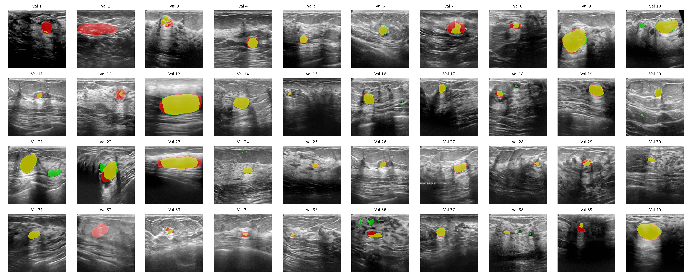
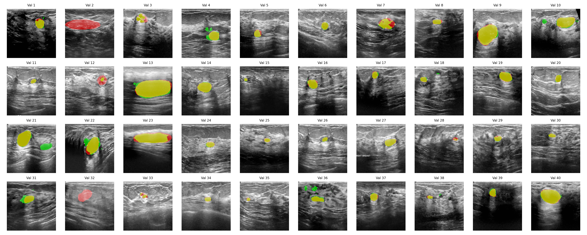
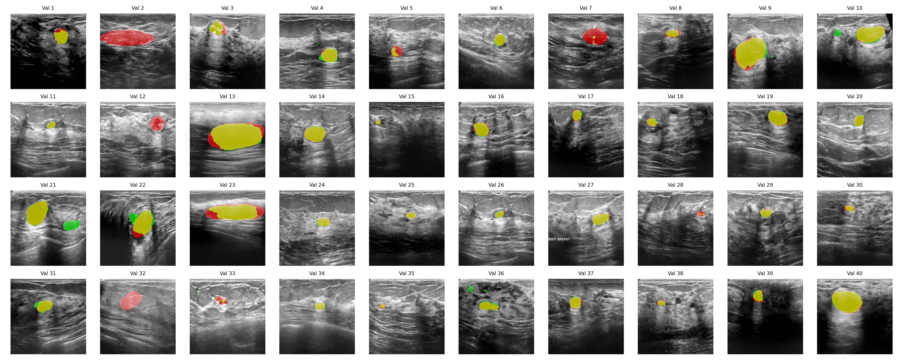
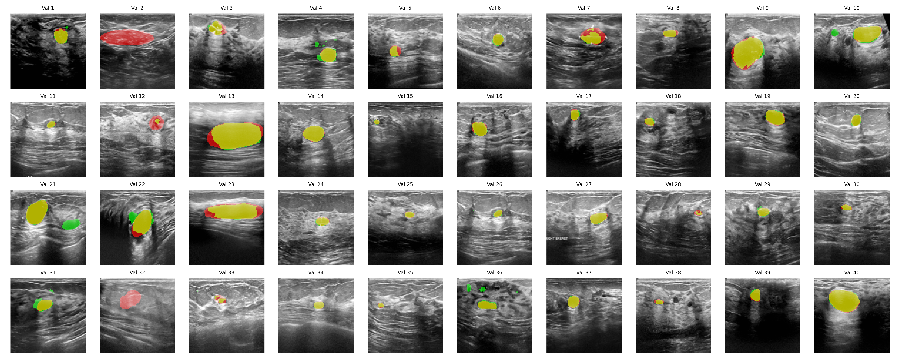
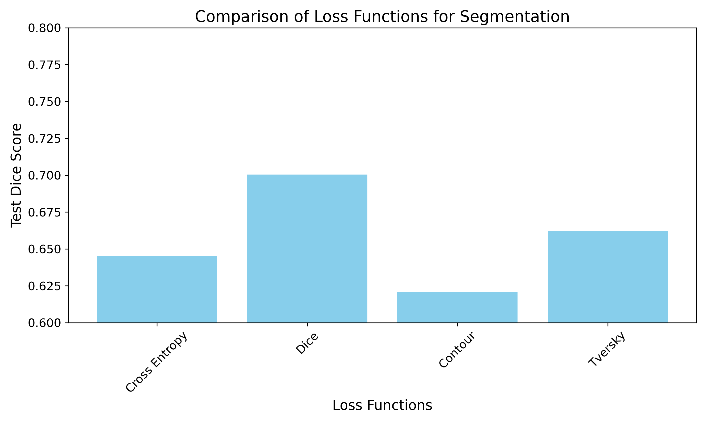

# Loss Function Experimentation for Segmentation

## Objective
The goal of this experiment is to identify the most effective loss function for breast ultrasound segmentation by evaluating the performance of different commonly used loss functions. Based on the study by Han, Yuexing, et al. (2021), we will compare the following loss functions:

---

## Loss Functions

### 1. **Cross Entropy Loss**
Cross Entropy is a widely used loss function for classification tasks. It measures the difference between the predicted probability distribution and the ground truth labels. In segmentation, it calculates the pixel-wise classification loss.

**Formula**:
$$
\mathcal{L}_{CE} = - \frac{1}{N} \sum_{i=1}^{N} \left[ y_i \log(\hat{y}_i) + (1 - y_i) \log(1 - \hat{y}_i) \right]
$$

### 2. **Dice Loss**
Dice Loss measures the overlap between the predicted segmentation and the ground truth. It is particularly useful for imbalanced datasets where one class dominates.

**Formula**:
$$
\mathcal{L}_{Dice} = 1 - \frac{2 \cdot |P \cap G|}{|P| + |G|}
$$

Where:
- $P$: Predicted mask
- $G$: Ground truth mask

### 3. **Contour Loss**
Contour Loss focuses on improving the prediction of object boundaries by penalizing the discrepancy between predicted and true contours. It is computed by emphasizing pixels along the edges.

**Key Features**:
- Useful when boundary precision is critical.
- Encourages the model to focus on edge refinement.

### 4. **Tversky Loss**
Tversky Loss is a generalization of Dice Loss that introduces two parameters, \(\alpha\) and \(\beta\), to control the trade-off between false positives and false negatives.

**Formula**:
$$
\mathcal{L}_{Tversky} = 1 - \frac{|P \cap G|}{|P \cap G| + \alpha \cdot |P \setminus G| + \beta \cdot |G \setminus P|}
$$

Where:
- $|P \cap G|$: Intersection between predicted and ground truth masks
- $|P \setminus G|$: False positives
- $|G \setminus P|$: False negatives
- $\alpha, \beta$: Weighting factors $\alpha + \beta = 1$.

---

## Results

### Quantitative Results
The performance of each loss function is evaluated using the Dice Score metric on the test dataset.

| Loss Function       | Test Dice Score |
|---------------------|-----------------|
| Cross Entropy Loss  | 0.6451          |
| Dice Loss           | 0.7004          |
| Contour Loss        | 0.6208          |
| Tversky Loss        | 0.6622          |

---

### Visual Results
Below are the qualitative results showing the segmentation predictions on the test dataset for each loss function.

**Color Legend**:
- **Red**: Ground Truth (GT)
- **Green**: Predicted Segmentation
- **Yellow**: Overlap between Ground Truth and Prediction

#### 1. **Cross Entropy Loss**

---

#### 2. **Dice Loss**

---

#### 3. **Contour Loss**

---

#### 4. **Tversky Loss**

---

### Overall Comparison
Below is a bar chart summarizing the test Dice Scores for each loss function:

---

### Reference
> [1] Han, Yuexing, et al. "Boundary loss-based 2.5 D fully convolutional neural networks approach for segmentation: a case study of the liver and tumor on computed tomography." Algorithms 14.5 (2021): 144.  
> [2] https://www.kaggle.com/code/sungjunghwan/loss-function-of-image-segmentation
